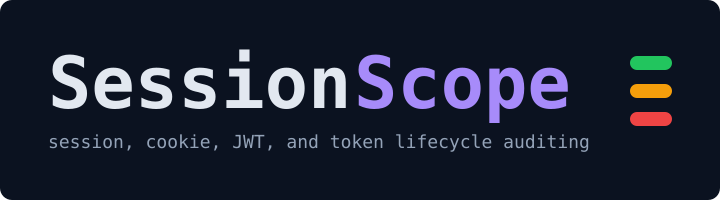

<p align="center">
  
</p>

<p align="center"><strong>Session, cookie, JWT, and token lifecycle auditing for product-security review.</strong></p>

<p align="center">
  <a href="https://github.com/Ozark-Security-Labs/SessionScope/actions/workflows/rust.yml"></a>
  <a href="https://github.com/Ozark-Security-Labs/SessionScope/actions/workflows/security.yml"></a>
  <a href="https://github.com/Ozark-Security-Labs/SessionScope/actions/workflows/codeql.yml"></a>
  <a href="LICENSE"></a>
</p>

---

SessionScope maps how authentication artifacts move through your application — how cookies, JWTs, refresh tokens, and password-reset tokens are issued, stored, transmitted, validated, refreshed, revoked, expired, and introspected. It answers a foundational appsec question — **what controls each artifact actually has, and where they go missing?** — by building an evidence-bound lifecycle inventory you can review before code ships.

Authentication security is a lifecycle problem, not a login problem. SessionScope gives you the lifecycle inventory.

## Quickstart

Install from source:

```bash
cargo install --git https://github.com/Ozark-Security-Labs/SessionScope sessionscope-cli
```

Then bootstrap a config and scan:

```bash
sessionscope init
sessionscope scan --path . --format markdown --output sessions.md
```

### GitHub Action — coming soon

A first-party GitHub Action is on the roadmap. When it ships, CI integration will look like this:

```yaml
- uses: actions/checkout@v4
- uses: Ozark-Security-Labs/SessionScope@v0
  with:
    mode: advisory
    output: markdown,sarif
```

Tracked in [docs/ROADMAP.md](docs/ROADMAP.md). Until then, run `sessionscope` directly in a CI job — see [CI integration](#ci-integration) below.

## Sample output

A scan flags a session cookie missing `HttpOnly` with the evidence that supports the call:

```text
Cookie: session
Set at: app/auth/session.py:71
Attributes:
  - HttpOnly: missing
  - Secure: present
  - SameSite: lax
  - Max-Age: 30 days
Risk: high_confidence_misconfiguration
Suggested fix:
  - Set HttpOnly on session cookies so client-side scripts cannot read them.
```

The same scan emits JSON for automation, including artifact context, linked evidence, and a reviewer question:

```json
{
  "id": "finding_0001",
  "category": "high_confidence_misconfiguration",
  "severity": "high",
  "artifact_ids": ["artifact_0001"],
  "evidence_ids": ["evidence_cookie_http_only"],
  "title": "Session-like cookie `session` does not set HttpOnly",
  "description": "No HttpOnly attribute evidence was detected for this cookie-setting call.",
  "suggested_fix": "Set HttpOnly on session cookies so client-side scripts cannot read them.",
  "reviewer_question": "Is this cookie intended to be inaccessible to browser JavaScript?"
}
```

The full JSON contract is documented in [docs/SCHEMA.md](docs/SCHEMA.md); end-to-end examples live in [docs/USAGE.md](docs/USAGE.md).

## What you get

**Evidence-bound lifecycle map.** SessionScope models auth artifacts through eight stages — `issue`, `store`, `transmit`, `validate`, `refresh`, `revoke`, `expire`, `introspect` — and ties every finding to detector evidence with stable IDs. Reports state precise things ("No audience validation evidence detected near JWT verification.") and avoid unsupported claims.

**Reviewer workflows in CI.** Capture a JSON baseline of accepted findings, diff future scans against it, and resolve any finding ID back to its supporting context. Useful for PR review and slow burndown of legacy posture.

```bash
sessionscope scan --path . --format json --output sessions.json
sessionscope baseline create --from sessions.json --output sessionscope-baseline.json
sessionscope diff --baseline sessionscope-baseline.json --current sessions.json --format markdown
sessionscope explain finding_0001 --report sessions.json
```

**Multi-framework, multi-language.** One tool covers session, cookie, JWT, and refresh-token patterns across Express, Next.js, FastAPI, Django, and generic JS/TS/Python JWT libraries — so the same lifecycle issue is detectable wherever it lives.

**Defensive by design.** SessionScope is offline-only and never prints token values, private keys, bearer strings, or cookie values. Source text passes through `sessionscope-core::redaction` before it reaches any report. The full trust boundary is documented in [docs/DATA_HANDLING.md](docs/DATA_HANDLING.md).

## Supported frameworks

| Framework | Language(s) |
| --------- | ----------- |
| Express | Node.js / TypeScript |
| Next.js (App Router) | TypeScript |
| FastAPI | Python |
| Django | Python |
| Generic JWT handling | TypeScript, JavaScript, Python |

Detectors are heuristics that look for known middleware, decorators, library calls, and cookie-setting APIs. See [docs/ARCHITECTURE.md](docs/ARCHITECTURE.md) for the detector and classifier contracts.

## CLI overview

| Command | Purpose |
| ------- | ------- |
| `sessionscope init` | Generate a checked-in `sessionscope.toml` |
| `sessionscope scan` | Run the full analyzer against a path |
| `sessionscope cookies` / `claims` / `logout` / `refresh` | Focused views over `scan`, filtered to one capability area (Markdown or JSON only) |
| `sessionscope explain FINDING_ID --report REPORT.json` | Print supporting context for any finding ID |
| `sessionscope baseline create --from REPORT.json` | Snapshot the current finding set as a baseline |
| `sessionscope diff --baseline BASELINE.json --current REPORT.json` | Compare a fresh scan against a saved baseline |
| `sessionscope version` | Print the CLI version |

Full flags, exit semantics, and the complete check catalog are in [docs/USAGE.md](docs/USAGE.md). Configuration lives in [docs/CONFIGURATION.md](docs/CONFIGURATION.md).

## Output formats

| Format | Use it for |
| ------ | ---------- |
| Markdown | Human review, PR comments, GitHub Actions job summaries |
| JSON | Automation and downstream tooling (schema v0.5.0 contract) |
| SARIF | GitHub / GitLab code scanning, advisory alerts |
| GitHub summary | CI job summaries on `pull_request` runs |

The canonical JSON contract is documented in [docs/SCHEMA.md](docs/SCHEMA.md).

## CI integration

Until the first-party Action ships, run `sessionscope` directly:

```yaml
name: SessionScope
on:
  pull_request:

permissions:
  contents: read

jobs:
  sessionscope:
    runs-on: ubuntu-latest
    steps:
      - uses: actions/checkout@v4
      - uses: dtolnay/rust-toolchain@stable
      - run: cargo install --git https://github.com/Ozark-Security-Labs/SessionScope sessionscope-cli
      - run: sessionscope scan --path . --format markdown --output sessions.md
      - run: cat sessions.md >> "$GITHUB_STEP_SUMMARY"
```

`sessionscope` exits `0` on success and `1` on error; findings do not affect exit status. Severity-gated exits are tracked in [docs/ROADMAP.md](docs/ROADMAP.md).

## Project status

- **Milestone:** v0.8.0 — reviewer workflows (current branch). MVP is imminent.
- **Complete:** v0.1 foundation, v0.2 cookie audit, v0.3 JWT validation, v0.4 lifecycle mapping, v0.5 expanded token handling, v0.8 reviewer workflows (`baseline create`, `diff`, `explain`, capability aliases for `cookies` / `claims` / `logout` / `refresh`).
- **Schema:** JSON contract v0.5.0.
- **Rust:** edition 2024. MSRV is not yet pinned.
- **Platforms:** developed on Linux. macOS and Windows are not yet covered in CI.
- **Versioning:** workspace `Cargo.toml` is still `0.1.0`. Tagged releases will land after MVP.

Phase plan and upcoming work in [docs/ROADMAP.md](docs/ROADMAP.md).

## Documentation

| Document | Contents |
| -------- | -------- |
| [docs/USAGE.md](docs/USAGE.md) | End-to-end CLI usage, lifecycle stages, token types, check catalog |
| [docs/SCHEMA.md](docs/SCHEMA.md) | JSON inventory and finding schema (v0.5.0) |
| [docs/CONFIGURATION.md](docs/CONFIGURATION.md) | `sessionscope.toml` reference and precedence rules |
| [docs/DATA_HANDLING.md](docs/DATA_HANDLING.md) | Redaction trust boundary and report sensitivity |
| [docs/ARCHITECTURE.md](docs/ARCHITECTURE.md) | Pipeline, crate layout, and detector contract |
| [docs/DESIGN_DECISIONS.md](docs/DESIGN_DECISIONS.md) | Rationale for config, defaults, confidence levels |
| [docs/PRODUCT_BRIEF.md](docs/PRODUCT_BRIEF.md) | Product framing, target users, MVP criteria |
| [docs/ROADMAP.md](docs/ROADMAP.md) | Phase plan and future milestones |

## Security

SessionScope is intended for authorized, defensive analysis of code that you own or are explicitly approved to review. Report vulnerabilities privately via [SECURITY.md](SECURITY.md).

Supply-chain posture:

- `Cargo.lock` is committed and reviewed.
- GitHub Actions in security-critical workflows are pinned to full commit SHAs.
- CI runs `cargo test`, `security.yml`, `codeql.yml`, and dependency-determinism checks on every PR.

## Contributing

Design-first contributions are welcome — new framework detectors, lifecycle evidence, classifier improvements, and documentation.

- [CONTRIBUTING.md](CONTRIBUTING.md) — how to propose and submit changes
- [CODE_OF_CONDUCT.md](CODE_OF_CONDUCT.md) — community standards
- [GOVERNANCE.md](GOVERNANCE.md) — maintainer and decision-making model
- [SUPPORT.md](SUPPORT.md) — getting help

## Sibling projects

Part of [Ozark Security Labs](https://github.com/Ozark-Security-Labs). See also [AuthMap](https://github.com/Ozark-Security-Labs/AuthMap) — authorization coverage mapping for application code.

## Non-goals

SessionScope is not intended to:

- exploit authentication systems
- brute-force tokens
- attack live applications
- steal or decode secrets
- replace manual security review

## License

SessionScope is licensed under the [MIT License](LICENSE).
